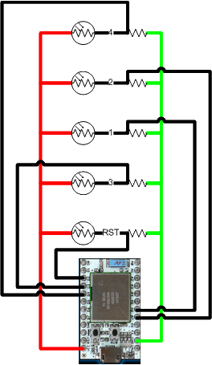
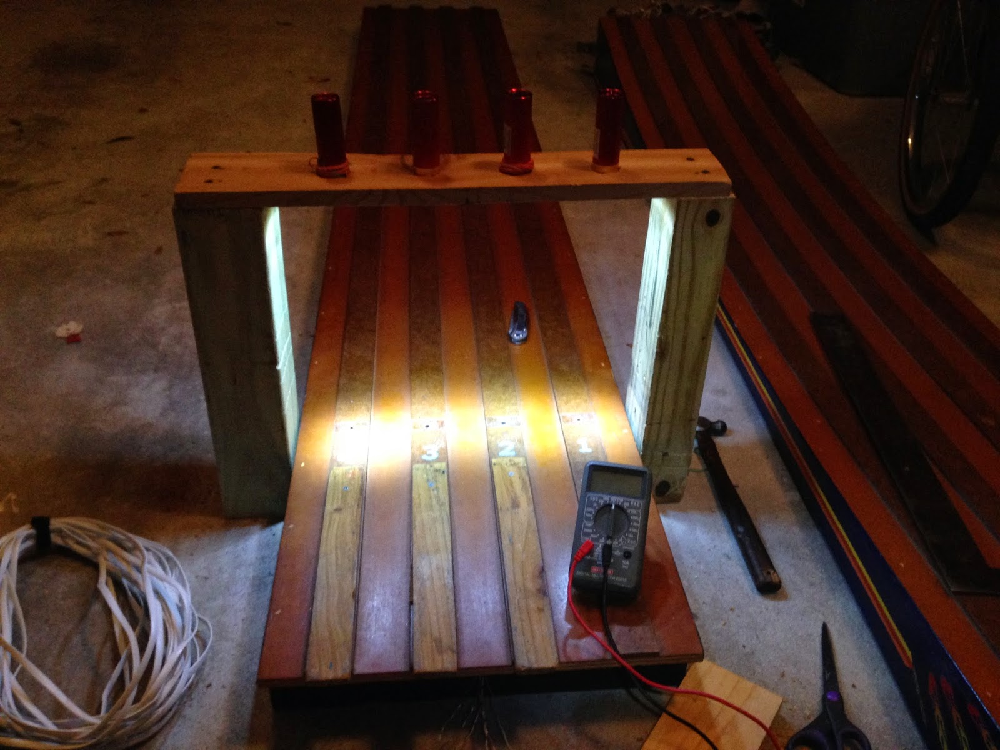

# pinewoodderbytimer
Spark Core based timer for Pinewood derby track

A long time ago, a cubmaster friend of mine mentioned his troubles with the upcoming Pinewood Derby that the local cubs were going to participate in. He had a track but no easy way to determine the winner except with some judges sitting at the finish line. He mentioned how he might forego using his own den's track and borrow one from another cubmaster friend of his that has an electronic timer. After talking with his friend, it became apparent that it wasn't in working order and would need some TLC from someone experienced enough with the microcontroller used. This is what spurred the conversation with me.

Not having any experience with that particular type of microcontroller, I told him I could research some ways that I could build one into his track (thinking perhaps that it could be another use for the RaspberryPi). I spent a few days "thinking about it" (i.e. on the back burner). I even started a python script that I could use in conjunction with the GPIO ports and some photo resistors to get the times. However, after digging a little deeper, it appeared while this was possible the result wouldn't be accurate.

In steps the [Spark Core](https://www.spark.io/). I had seen this little beauty back when it was in its Kickstarter campaign and went ahead and purchased one back then thinking I could use it as the brains for my [iPhone controlled garage door opener](http://stuart.weenig.com/p/dopi.html). While it turned out the RaspberryPi was more suited for that, the Spark Core seemed a perfect candidate for this project.

[I posted to the Spark community](https://community.spark.io/t/stopwatch-for-pinewood-derby/3486/31) that I wanted to try to use the Core for a Pinewood Derby Race timer and got tons of support. Total props to [Brian Ogilvie (bko)](https://community.spark.io/users/bko/activity) and [BDub](https://community.spark.io/users/bdub/activity) who even gave up some sleep to help out a complete noob.

Here's the finish line. I purchased 4 novelty LED flashlights from the local hardware store and mounted them above. You can barely see the holes, but they are there. There's about 3/4 of an inch between the surface of the track down to the photo resistors, so there shouldn't be any bleed over between lanes or from stray light sources.

I used [this code](test.cpp) on the Spark Core for testing the circuits to make sure the lights were powerful enough and that the shadows were dark enough. Here's the [final code](main.cpp) used during the race. I hooked up the Spark Core to my laptop, [installed the driver](https://community.spark.io/t/installing-the-usb-driver-on-windows-serial-debugging/882), opened Putty, and connected to the COM port.

So, in the testing, I got an accuracy of ±0.00002 seconds. Once the photoresistors were hooked up, the accuracy became harder to test. However, by sliding a single board over all 4 lanes at the finish line "at the same time", I got about ±0.02 seconds. The degraded accuracy is probably due to the photoresistor reaction times and the fact that even though I tried, I might not have been pushing the board across all four holes at the exact same time.

Here's the video. I finally got around to getting it off my phone and editing it all together.

